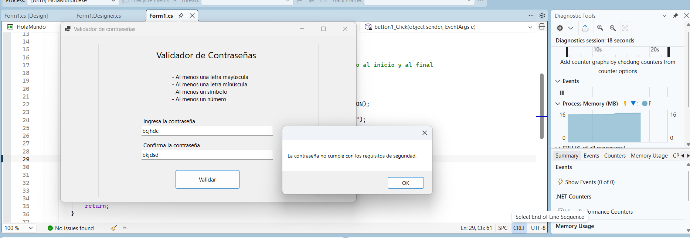
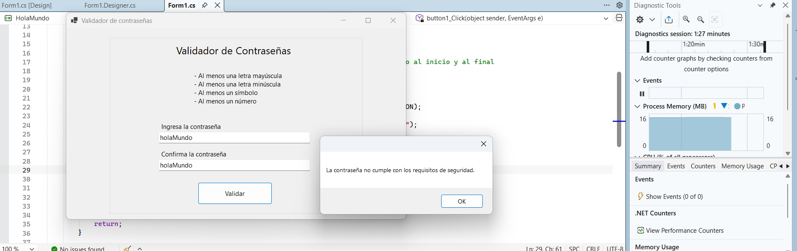
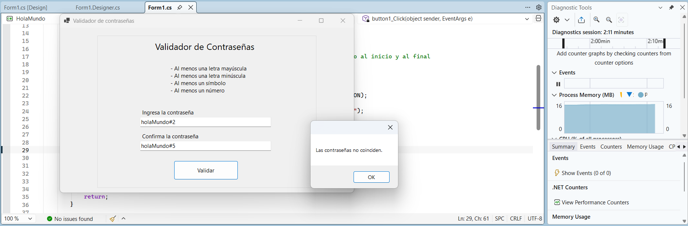

# Warm up: Validador de contraseñas con WINFORMS

- Para correr este programa es necesario tener instaldo Visual Studio.
- Tener las opciones instaladas:
    - Desarrollo Multiplataforma .Net (Netcore) 8 y 9 
    - Desarrollo Escritorio .Net (Winforms)
- Abrir la carpeta HelloWorld en VS y ejecutar el programa.

## Objetivos
Incorporar a la vista dos campos de texto y un botón que validen la estructura de una contraseña, la contraseña deberá exigir:
Al menos una letra mayúscula
Al menos una letra minúscula
Al menos un símbolo
Al menos un número
Si la contraseña ingresada corresponde a la regla solicitada, la siguiente validación comprobará que el segundo campo contenga el mismo texto
Una vez que esto suceda deberá aparecer un MESSAGE BOX que diga "La contraseña ha sido validada"

Tu programa deberá contener:
Un evento click en el botón, que envía el formulario y que retorna la validación.
Una expresión regular (Regex) que valide la regla propuesta.

## Eviencias:
### Contraseñas no siguen lineamientos y no coinciden:

### Contraseñas no siguen lineamientos:

### Contraseñas siguen lineamientos pero no coinciden:

### Contraseñas siguen lineamientos y coinciden:

